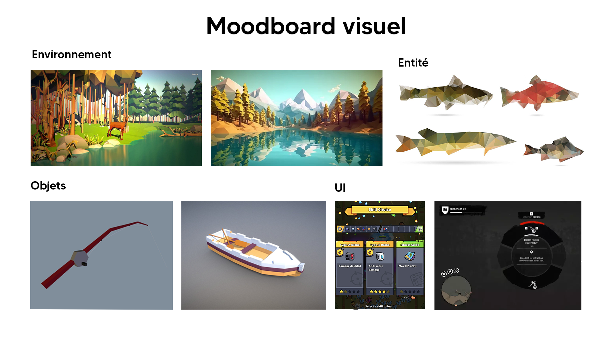

# Projet Fishing 

## Un résumé en une phrase :
Le joueur sera dans un monde partiellement ouvert et devra pêcher afin d'améliorer ses compétences de pêcheurs.

## Une description 
Le jeu sera d'un style "Rogue-lite", c'est-à-dire récupérer des points d'expériences et des items afin d'améliorer son personnage et son équipement. Dans le cas de notre jeu, les joueurs devront pêcher des poissons afin de gagner en niveau et à chaque certaine quantité "d'XP" accumulé, ils pourront choisir un talent passif (lancer la ligne plus loin, les poissons mord plus fréquemment, moins de chance de perdre le poisson ou le leurre, etc.) qui l'aideront à progresser plus facilement dans le jeu. Autres que les points d'expérience, les joueurs pourront vendre leurs poissons au marchand, qui sera situé sur la terre ferme. En échange, celui-ci vous donnera de l'argent que vous pourriez utiliser dans son magasin afin d'avoir de meilleurs équipements (comme la canne à pêche, les leurres et les appâts). Visuellement, le jeu sera modélisé avec des formes ayant peu de formes (low poly) dans un environnement de forêt avec plusieurs sections de lacs. Ceci serait les systèmes principaux que nous envisageons : jour et nuit, expérience, points d'or, déplacement dans une barque, apparition aléatoire des poissons.
La partie se termine si le joueur n'a plus de leurres, leurres qui peut perdre si échoue au passage du poisson, ceci serait considéré comme une défaite. En revanche, si le joueur parvient à déverrouiller chaque section du lacs, il gagnerait la partie et aura le choix de poursuivre la partie ou en recommencer une.

## Moodboard visuel et sonore

### 1. [Overcooked OST - Main Menu](https://www.youtube.com/watch?v=WZbQrsR09KE)
### 2. [Slime Rancher - Theme](https://www.youtube.com/watch?v=XVICKp0UyKs&list=OLAK5uy_kNtisC0RmQPxX88BKricbHwm6tCkvThIw)
### 3. [10 Hours | Sailing Ship Ambience • A Soothing Voyage Across the Sea](https://www.youtube.com/watch?v=QI3lHS55OaU)
### 4. [Unlock / Open / Close Chest Sound Effect](https://www.youtube.com/watch?v=gQqaABe4RyM)
### 5. 
### 6. [Fishing Reel Sound Effect Fx](https://www.youtube.com/watch?v=MUny9Nl27Zs)

